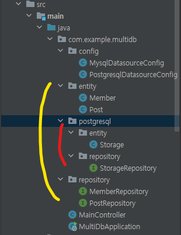
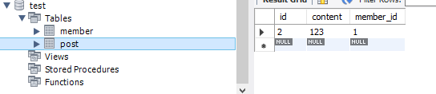
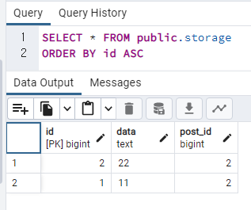
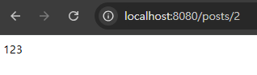
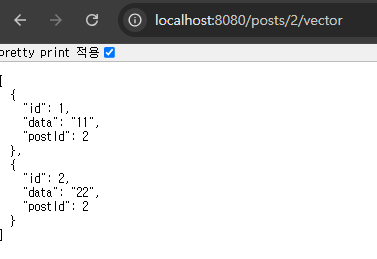

## 멀티 DB 연동
* 폴더 구조 : <br/>
  
  * 노랑 : mysql
  * 빨강 : postgresql
    <br/><br/>
    
### 각 DB에 저장될 entity
* Mysql : **<u>Member, Post</u>**
  
* Postgresql : **<u>Storage</u>**
  
  


### 테스트
* Post의 content 조회 
    ```java
    @GetMapping("/posts/{id}")
    public ResponseEntity<String> getPost(@PathVariable Long id){
        return ResponseEntity.ok(postRepository.findById(id).orElseThrow(() -> new RuntimeException("없습니다")).getContent());
    }
    ```
    

* Post의 Storage 조회
    ```java
    @GetMapping("/posts/{id}/vector")
    public ResponseEntity<List<Storage>> getPostAndStorageListByPost(@PathVariable Long id){
        Post post = postRepository.findById(id).orElseThrow(() -> new RuntimeException("없습니다"));
        List<Storage> storageList = storageRepository.findByPostId(post.getId());
        return ResponseEntity.ok(storageList);
    }
    ```
    
  

###### 참조
* 설정 : https://velog.io/@juhyeon1114/JPAQuerydsl-Multiple-Databases%EB%8B%A4%EC%A4%91-DB-%EC%84%A4%EC%A0%95%ED%95%98%EA%B8%B0
* LocalContainerEntityManagerFactoryBean에 properties 추가 : https://velog.io/@lehdqlsl/SpringBoot-JPA-Multiple-Databases-%EC%84%A4%EC%A0%95